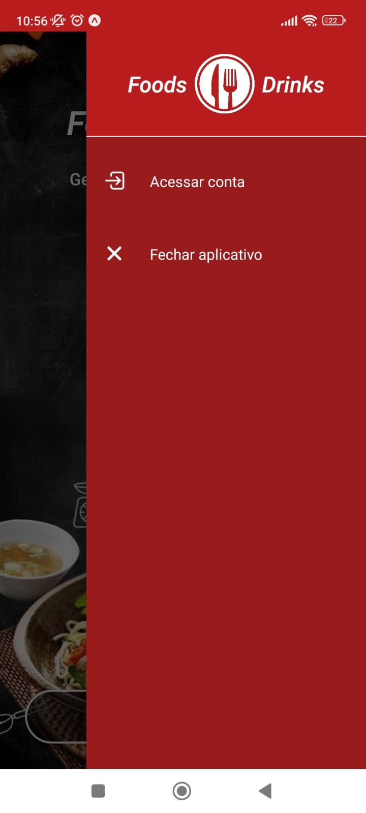

# Projeto - Restaurante Foods 'N' Drinks Mobile
## Descrição
- Este é um projeto em **React Native** e **Typescript** com a finalidade de aprendizado e colaboração, onde foi implementado o aplicativo um projeto de restaurante fictício denominado **Foods 'N' Drinks**.
- Suas funcionalidades basicamente são:
  - Cadastro e controle de Pedidos  
  - Cadastro e controle de Mesas  
  - Cadastro e controle de Clientes
  - Cadastro e controle de Refeições
  - Cadastro e controle de Usuários  
  - Cadastro e controle de Perfis  

Este projeto encontra-se em inacabado e pausado, porém algumas telas podem ser visualizadas.

## Screenshots
 
  
  
  
  
  
  
  

